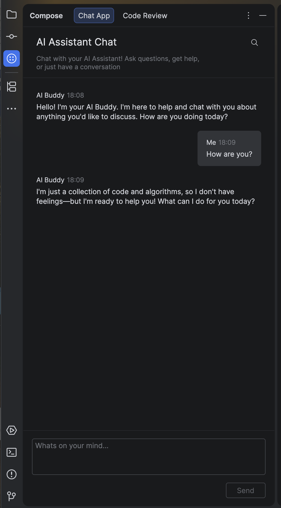
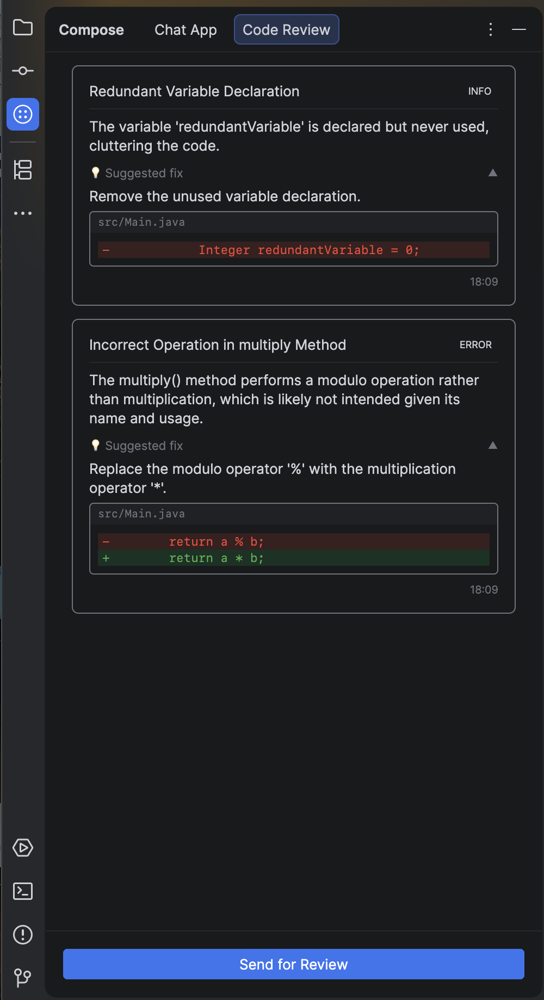
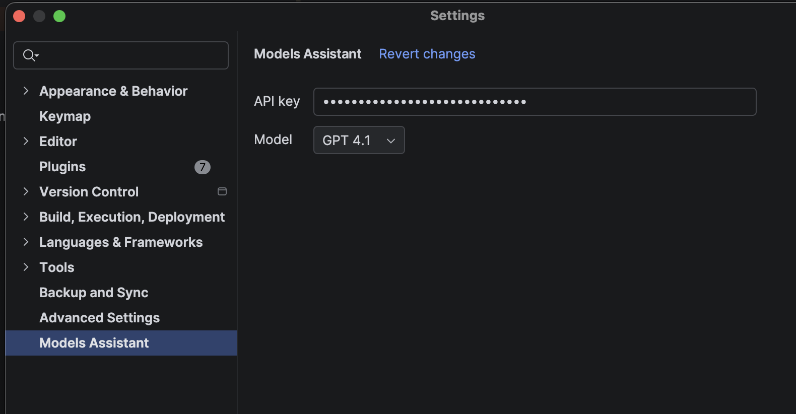

# ChatAI

<!-- Plugin description -->
An IntelliJ Platform plugin with a chat interface and tools for code review.
<!-- Plugin description end -->

## Features

- In-IDE chat with AI
- Quick summaries and suggestions for code review
- Configurable settings for providers and preferences (currently only GithubModels)

## Screenshots

### Chat

### Code review

### Settings

## Development

This project is based on Gradle and the IntelliJ Platform Plugin SDK. See `README_template.md` for configuration details.
